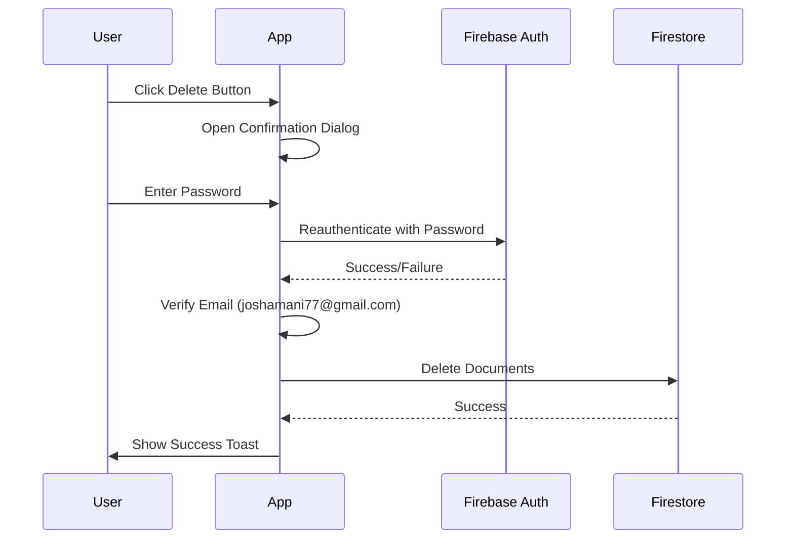

# Admin Controls - Firebase Configuration Guide

This guide explains what you need to configure in Firebase to enable the Admin Controls functionality in your Business Bloom application.

## 🔐 What Has Been Implemented

The Admin Controls feature has been successfully added to your application with the following components:

1. **New Service File**: [`src/services/adminService.ts`](src/services/adminService.ts)
   - Password verification using Firebase reauthentication
   - Functions to delete all records from each collection
   - Function to delete only depleted batches

2. **Updated Settings Page**: [`src/pages/Settings.tsx`](src/pages/Settings.tsx)
   - New "Admin Controls" tab
   - 10 deletion buttons for different collections
   - Password confirmation dialog
   - Email validation for joshamani77@gmail.com

3. **Deletion Functions Available**:
   - Delete Depleted Batches (batches with 0 remaining items)
   - Delete All Sales
   - Delete All Services Offered
   - Delete All Products
   - Delete All Services
   - Delete All Inventory Records
   - Delete All Purchase Orders
   - Delete All Batches
   - Delete All Stock Adjustments
   - Delete All Expenses

---

## 🚀 Firebase Configuration Steps

### Step 1: Enable Email/Password Authentication

1. Go to [Firebase Console](https://console.firebase.google.com/)
2. Select your project
3. Navigate to **Authentication** → **Sign-in method**
4. Find **Email/Password** and click on it
5. Enable the **Email/Password** sign-in provider
6. Click **Save**

**Why this is needed**: The admin controls require password verification using Firebase's `reauthenticateWithCredential` function, which requires Email/Password authentication to be enabled.

### Step 2: Verify Google Authentication is Enabled

1. In Firebase Console, go to **Authentication** → **Sign-in method**
2. Find **Google** and click on it
3. Ensure **Google** sign-in provider is enabled
4. Click **Save** if needed

**Why this is needed**: Your application uses Google OAuth for login, and the admin account (joshamani77@gmail.com) likely uses Google authentication.

### Step 3: Set Up the Admin Account

You need to ensure the admin account `joshamani77@gmail.com` exists and has both Google OAuth AND Email/Password authentication enabled.

#### Option A: If the User Already Exists

1. Go to **Authentication** → **Users** in Firebase Console
2. Find the user with email `joshamani77@gmail.com`
3. Click on the user to view details
4. Check the **Sign-in providers** section
5. If only **Google** is listed, you need to add a password:

   **To add a password to an existing Google user:**
   - The user needs to sign in to your app
   - Go to the Settings page → Security tab
   - Change their password using the "Update Password" feature
   - This will add Email/Password as an additional sign-in method

#### Option B: If the User Doesn't Exist

1. Go to **Authentication** → **Users** in Firebase Console
2. Click **Add user**
3. Enter:
   - **Email**: `joshamani77@gmail.com`
   - **Password**: [Set a strong password]
   - **Phone number**: (Optional)
4. Click **Add user**

**Important**: After creating the user with Email/Password, they should also sign in with Google OAuth to link both authentication methods.

### Step 4: Verify Firestore Collections

Ensure the following collections exist in your Firestore database (they should already exist based on your app usage):

- `sales`
- `servicesOffered`
- `products`
- `services`
- `inventory`
- `purchases`
- `inventoryBatches`
- `stockAdjustments`
- `expenses`

**To verify**:

1. Go to **Firestore Database** in Firebase Console
2. Click **Start collection** or view existing collections
3. Ensure all the above collections are listed

### Step 5: (Optional) Update Firestore Security Rules

For production environments, consider adding more restrictive security rules. Create or update your `firestore.rules` file:

```javascript
rules_version = '2';
service cloud.firestore {
  match /databases/{database}/documents {

    // Allow read/write for authenticated users on most collections
    match /{document=**} {
      allow read, write: if request.auth != null;
    }

    // Optional: Add special rules for admin operations
    // This requires setting custom claims on the admin user
    // match /{collection}/{document=**} {
    //   allow delete: if request.auth.token.admin == true;
    // }
  }
}
```

**To deploy security rules**:

1. In Firebase Console, go to **Firestore Database** → **Rules**
2. Paste the rules above
3. Click **Publish**

---

## ✅ Testing the Implementation

### Test 1: Verify Admin Account Setup

1. Sign out of your application
2. Sign in with `joshamani77@gmail.com` using Google OAuth
3. Navigate to Settings → Security
4. Verify you can change the password (this confirms Email/Password auth is linked)

### Test 2: Test Admin Controls Access

1. Navigate to Settings → Admin Controls
2. Click any deletion button (e.g., "Delete Depleted Batches")
3. A confirmation dialog should appear
4. Enter the correct password
5. Click "Confirm Delete"
6. You should see a success message

### Test 3: Test Password Verification

1. Click a deletion button
2. Enter an incorrect password
3. Click "Confirm Delete"
4. You should see an error message: "Invalid password or unauthorized access"

### Test 4: Test Email Authorization

1. Sign in with a different account (not joshamani77@gmail.com)
2. Navigate to Settings → Admin Controls
3. Click a deletion button
4. Enter any password
5. Click "Confirm Delete"
6. You should see an error message: "You are not authorized to perform admin actions"

---

## 🔍 Troubleshooting

### Issue: "No authenticated user found" error

**Cause**: User is not logged in or authentication session expired.

**Solution**:

- Sign out and sign back in
- Ensure you're logged in as `joshamani77@gmail.com`

### Issue: "You are not authorized to perform admin actions" error

**Cause**: The logged-in user is not `joshamani77@gmail.com`.

**Solution**:

- Sign out and sign in with `joshamani77@gmail.com`
- Verify the email is exactly `joshamani77@gmail.com` (case-sensitive)

### Issue: "Invalid password" error

**Cause**: The password entered doesn't match the Firebase account password.

**Solution**:

- Ensure the user has a password set (not just Google OAuth)
- If only Google OAuth is enabled, set a password via Settings → Security
- Try resetting the password in Firebase Console

### Issue: "Failed to delete [collection]" error

**Cause**: Firestore permissions or network issues.

**Solution**:

- Check Firestore security rules
- Verify you have an active internet connection
- Check Firebase Console for any quota limits or issues

### Issue: Cannot set password for Google OAuth user

**Cause**: The user only has Google authentication linked.

**Solution**:

1. Sign in to your app with Google
2. Go to Settings → Security
3. Use the "Update Password" feature to add Email/Password auth
4. This will link both authentication methods

---

## 🛡️ Security Considerations

### Current Security Measures

1. **Email Validation**: Only `joshamani77@gmail.com` can perform deletions
2. **Password Verification**: Requires reauthentication with current password
3. **Confirmation Dialog**: Prevents accidental deletions
4. **Toast Notifications**: Provides feedback on success/failure

### Recommendations for Production

1. **Add Audit Logging**: Log all admin actions with timestamps and user details
2. **Implement Rate Limiting**: Prevent brute force password attempts
3. **Use Custom Claims**: Instead of hardcoded email checking, use Firebase Custom Claims
4. **Add Two-Factor Authentication**: Require 2FA for admin operations
5. **Implement Soft Deletes**: Mark records as deleted instead of removing them permanently
6. **Add Backup System**: Create automated backups before deletions

### Example: Using Custom Claims (Advanced)

Instead of checking for a specific email, you can set custom claims:

```typescript
// In a Cloud Function or admin SDK
admin.auth().setCustomUserClaims(uid, { admin: true });

// In your client code
if (auth.currentUser?.token.claims.admin) {
  // User is an admin
}
```

---

## 📊 How It Works

### Authentication Flow



### Deletion Process

1. User clicks a deletion button
2. Confirmation dialog opens
3. User enters password
4. App verifies email is `joshamani77@gmail.com`
5. App reauthenticates user with password
6. If successful, app queries Firestore for all documents in the collection
7. App deletes all documents in parallel
8. Success message shows number of deleted records

---

## 📝 Summary

### What You Need to Do in Firebase

1. ✅ Enable **Email/Password** authentication in Firebase Console
2. ✅ Ensure **Google** authentication is enabled
3. ✅ Set up the `joshamani77@gmail.com` account with both Google OAuth and Email/Password
4. ✅ Verify all Firestore collections exist
5. ✅ (Optional) Update security rules

### What's Already Implemented

1. ✅ Admin service with password verification
2. ✅ Admin Controls tab in Settings page
3. ✅ 10 deletion buttons with confirmation dialogs
4. ✅ Email validation for admin account
5. ✅ Toast notifications for feedback
6. ✅ Loading states during deletion

---

## 🎯 Next Steps

1. Complete the Firebase configuration steps above
2. Test the implementation with the admin account
3. Consider implementing additional security measures for production
4. Add audit logging if needed for compliance

If you encounter any issues during setup or testing, refer to the Troubleshooting section or check the Firebase Console for error messages.
